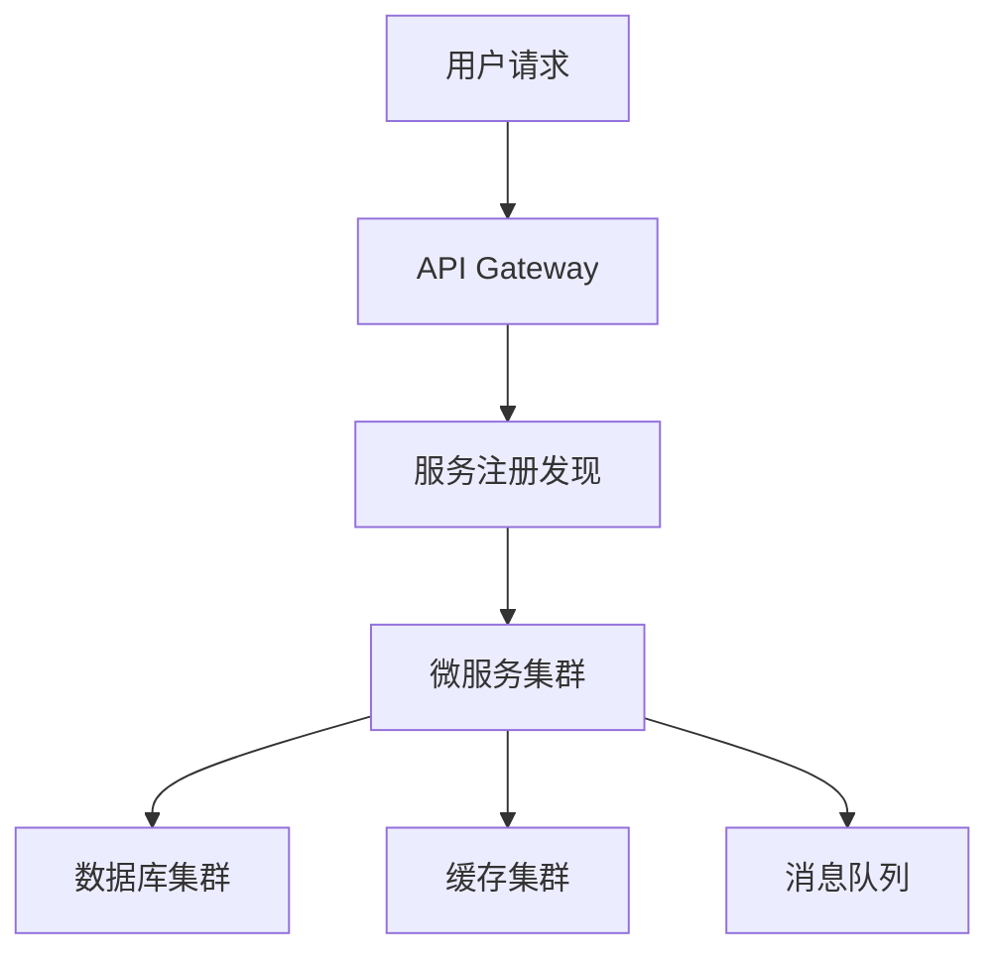

# 架构模式对照与 ADR

> 用法：先写清约束，再**对照**候选模式；禁止直接接表选型（同场景不同团队/规模，结论相反）。
> 检索与引用纪律见 @.agents/skills/research.md（报告落盘 `docs/research/`）。

## 模式对照表（场景信号 → 候选 → 适用条件 → 代价 → 何时别用）

| 场景信号 | 候选模式 | 适用条件 | 代价 / 风险 | 何时别用 |
| :--- | :--- | :--- | :--- | :--- |
| 单团队、领域未定、读写同源 | 模块化单体 | 团队 <10 人、交付速度优先、边界待验证 | 后期拆分成本；模块纪律靠评审守 | 多团队并行交付、需独立扩缩容 |
| 读远多于写、查询形态多 | CQRS | 读写比悬殊、需要多种读模型 | 双模型同步、最终一致、运维面变大 | 以强一致读为主、数据量小 |
| 需完整审计与回放 | 事件溯源 | 合规/审计/时间旅行需求真实存在 | 事件版本迁移、查询复杂、删除权难处理 | 普通 CRUD、无审计需求 |
| 跨服务/跨库的事务 | Saga / Outbox | 无法用单库事务、需要可靠消息 | 补偿逻辑、幂等设计、调试难度 | 单库事务可覆盖 |
| 峰值差大、多方消费 | 消息队列 / 事件驱动 | 需削峰或解耦、消费方 ≥2 | 运维成本、顺序与幂等、可观测性 | 请求-响应强耦合、无峰值 |
| 多租户 SaaS | schema / RLS / 库级隔离 | 按租户数 + 隔离要求分档选 | 迁移复杂、噪声邻居、连接池压力 | 少数强隔离租户（该独立部署） |
| 多端体验差异大 | BFF | 端形态（Web/移动/第三方）差异成主要成本 | 多一层维护与部署 | 单端产品 |
| 依赖不稳的三方集成 | 网关 + 熔断 + 退避 | 外部依赖有抖动历史、影响主链路 | 复杂度、配置治理 | 内部可信调用 |

## 对照四步法（写入 ADR 前必做）

1. **写清约束**：NFR 基线、团队规模与熟悉度、预算与工期、迁移成本、既有约束（`AGENTS.md`）。
2. **列 ≥2 个候选模式**（含"维持现状/最小改动"这个基线候选）。
3. **逐条打分**：适用条件是否成立 → 代价能否承受 → 团队能否维护。
4. **记录不采纳理由**：写进 ADR（不采纳的原因比采纳理由更有审计价值）。

## 最小示例



## ADR 模板

```md
# ADR-<编号>: <标题>
- 日期：YYYY-MM-DD
- 状态：提议 / 已接受 / 已废弃
- 背景：<问题与约束>
- 决策：<选择了什么>
- 理由：<对照四步法分析>
- 对照过的备选模式：<模式 → 不采纳原因（含"维持现状"基线）>
- 参考来源：<[标题](链接) · 访问 YYYY-MM-DD；无则写"未检索到">
- 备选方案：<列表 + 否决理由>
- 后果：<正面 / 负面 / 风险>
- 相关：<PRD / 关联 ADR / docs/research 路径>
```

> 长度上限 60 行、骨架与必写/可省/禁写见 @.agents/checklists/deliverable-docs.md §四。

## 误区

- 过度设计 / 追新 → 务实、成熟稳定优先
- 忽视 NFR → 性能/安全/可扩展作为核心设计目标
- 单点设计不考虑演进 → 预留扩展空间
